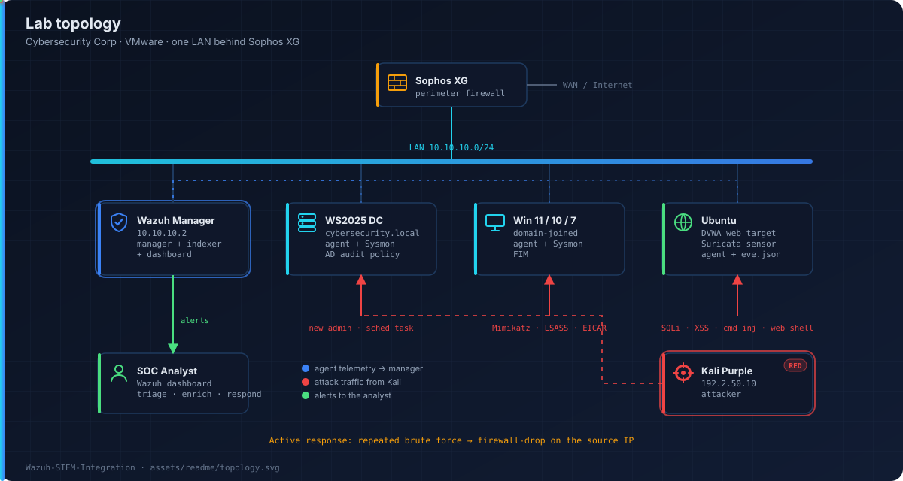
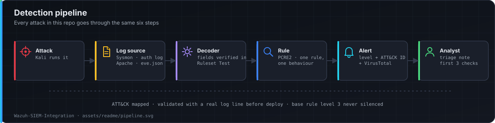

<p align="center"></p>

<p align="center">
  
  
  
  
  
</p>

A multi-OS Wazuh SIEM lab. Windows and Linux agents, file integrity monitoring, VirusTotal enrichment, Suricata network alerts, and DVWA as the target.

Every attack follows one loop: **run it → see it in Wazuh → write the rule → tell the analyst what to do.**

## Topology

<p align="center"></p>

| Host | Role | Wazuh side |
|---|---|---|
| Wazuh manager | Manager + indexer + dashboard (single node) | Manager 4.x |
| Windows Server 2025 | Domain controller `cybersecurity.local` | Agent + Sysmon + AD audit policy |
| Windows 11 / 10 / 7 | Domain-joined workstations | Agent + Sysmon + FIM |
| Ubuntu | DVWA web target + Suricata sensor | Agent (syslog + `eve.json`) |
| Kali Purple | Attacker | — |

## How a detection is built

<p align="center"></p>

1. **Decoder first** — check field names in `Ruleset Test` before writing any rule.
2. **PCRE2 over keywords** — anchored, case-insensitive, word boundaries, XML entities encoded.
3. **One rule, one behaviour** — base rules stay at level 3 and are never silenced. Escalation rules hang off the base rule.
4. **Validate, then deploy** — every rule is tested with a real log line first.
5. **Document the analyst side** — every alert has a triage note: meaning, false positives, first 3 checks, escalation.

## What is integrated

| Integration | Where | What the analyst gets |
|---|---|---|
| Sysmon → Wazuh | Windows agents | Process, network, registry and image-load events with parent/child context |
| File Integrity Monitoring | `/etc`, web root, `System32\drivers\etc` | Real-time change alerts with user + process |
| VirusTotal | Manager, on FIM events | Hash lookup for every new or changed file |
| Suricata → Wazuh | Ubuntu sensor | Network signatures correlated with host events |
| Active response | Manager | Auto `firewall-drop` on repeated SSH / web brute force |
| DVWA | Ubuntu | Target for SQLi, XSS, command injection, brute force |

## Attack → detection matrix

| Attack (from Kali) | ATT&CK | Evidence | Rule | Level |
|---|---|---|---|---|
| Nmap SYN / service scan | T1046 | Suricata ET SCAN | `100100` | 7 |
| SSH brute force (Hydra) | T1110.001 | `sshd` auth log | `100110` (8 / 120s) | 10 |
| DVWA SQL injection | T1190 | Apache access log | `100120` | 12 |
| DVWA reflected / stored XSS | T1189 | Apache access log | `100121` | 12 |
| DVWA command injection | T1059.004 | Apache log + `auditd` | `100122` | 13 |
| Web shell in web root | T1505.003 | FIM + VirusTotal | `100130` | 14 |
| EICAR / known-bad file | T1204.002 | FIM + VirusTotal | `100131` | 13 |
| Mimikatz / LSASS access | T1003.001 | Sysmon EID 10 | `100140` | 14 |
| New local admin | T1136.001 | Security 4720 / 4732 | `100150` | 12 |
| Scheduled task persistence | T1053.005 | Security 4698 / Sysmon 1 | `100151` | 11 |

Levels follow the production scheme: **0–6 log · 7–11 triage · 12–14 high, enrich and review · 15 critical, auto-block.**

## Repository layout

```
.
├── README.md
├── assets/readme/            # diagrams used on this page
├── docs/
│   ├── build-guide.md        # manager, agents, Sysmon, FIM + VirusTotal, Suricata, active response
│   └── attack-walkthroughs.md# each attack: command, what fired, analyst actions
├── rules/local_rules.xml     # custom rules 100100–100199, ATT&CK-tagged
└── decoders/local_decoder.xml
```

## Quick start

```bash
# manager (Ubuntu 22.04)
curl -sO https://packages.wazuh.com/4.x/wazuh-install.sh && sudo bash ./wazuh-install.sh -a

# load custom rules and decoders
sudo cp rules/local_rules.xml /var/ossec/etc/rules/
sudo cp decoders/local_decoder.xml /var/ossec/etc/decoders/
sudo systemctl restart wazuh-manager
```

Full build: [`docs/build-guide.md`](docs/build-guide.md) · Attack results: [`docs/attack-walkthroughs.md`](docs/attack-walkthroughs.md)

## Author

**Ebrahim Mohamed** — SOC Analyst · Detection Engineer · Cybersecurity Instructor
[LinkedIn](https://linkedin.com/in/EbrahimMohamed) · [GitHub](https://github.com/Ebrahim-Qareen)
