<p align="center"></p>

<p align="center">
  
</p>
<p align="center">
  
  
  
  
  
</p>

One loop for every attack: **run it → see it in Wazuh → write the rule → tell the analyst what to do.**

## Topology

<p align="center"></p>

## How a detection is built

<p align="center"></p>

## Build it yourself

<p align="center"></p>

| Step | Do this | Where |
|---|---|---|
| 1 | Build the VMs in VMware (Sophos XG, DC, Win 11/10/7, Ubuntu, Kali on the WAN side) | Topology above |
| 2 | Install the manager: `curl -sO https://packages.wazuh.com/4.x/wazuh-install.sh && sudo bash ./wazuh-install.sh -a` | [`docs/build-guide.md`](docs/build-guide.md) §1 |
| 3 | Enroll Windows / Linux agents, install Sysmon | §2 |
| 4 | Turn on FIM for `/etc`, web root, `System32\drivers\etc`; add the VirusTotal key | §3 |
| 5 | Install Suricata on Ubuntu, let the agent read `eve.json` | §4 |
| 6 | Enable active response (`firewall-drop`) | §5 |
| 7 | `cp rules/local_rules.xml /var/ossec/etc/rules/` · `cp decoders/local_decoder.xml /var/ossec/etc/decoders/` · restart | §6 |
| 8 | Run the SSH brute force from Kali, read alert `100110` | [`docs/attack-walkthroughs.md`](docs/attack-walkthroughs.md) §1 |

## Attack → detection matrix

| Attack (from Kali) | ATT&CK | Evidence | Rule | Level |
|---|---|---|---|---|
| Nmap SYN / service scan | T1046 | Suricata ET SCAN | `100100` | 7 |
| SSH brute force (Hydra) | T1110.001 | `sshd` auth log | `100110` (8 / 120s) | 10 |
| DVWA SQL injection | T1190 | Apache access log | `100120` | 12 |
| DVWA reflected / stored XSS | T1189 | Apache access log | `100121` | 12 |
| DVWA command injection | T1059.004 | Apache log + `auditd` | `100122` | 13 |
| Web shell in web root | T1505.003 | FIM + VirusTotal | `100130` | 14 |
| EICAR / known-bad file | T1204.002 | FIM + VirusTotal | `100131` | 13 |
| Mimikatz / LSASS access | T1003.001 | Sysmon EID 10 | `100140` | 14 |
| New local admin | T1136.001 | Security 4720 / 4732 | `100150` | 12 |
| Scheduled task persistence | T1053.005 | Security 4698 / Sysmon 1 | `100151` | 11 |

Levels: **0–6 log · 7–11 triage · 12–14 high · 15 critical, auto-block.**

## Layout

```
docs/build-guide.md          # steps 2–7
docs/attack-walkthroughs.md  # each attack: command, what fired, analyst actions
rules/local_rules.xml        # 100100–100199, ATT&CK-tagged
decoders/local_decoder.xml
assets/readme/               # diagrams on this page
```

**Ebrahim Mohamed** — SOC Analyst · Detection Engineer · Cybersecurity Instructor · [LinkedIn](https://linkedin.com/in/EbrahimMohamed)
